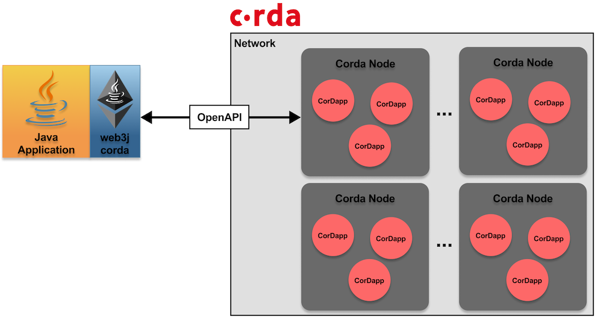

Web3j integration for Corda
===========================

## Introduction

web3j-corda is a lightweight client library for working with CorDapps and interacting with different nodes on Corda network.

## Features
- [x] Connect to a Corda node
- [x] Query the available CorDapps in the node
- [x] Generate CorDapp wrappers to interact with the deployed CorDapps
- [x] Generate integration tests using a fully Dockerized Corda network to test CorDapps against
- [x] Generate sample project with a CorDapp contract, workflow and client modules

## Modules

To provide greater flexibility for developers wishing to work with web3j-corda, the project is made up of a number of modules.

In dependency order, they are as follows:

* **api**: Corda and Network Map client API interfaces.
* **core**: Corda and Network Map clients implementation.
* **codegen**: CorDapp client code generation libraries.
* **console**: Command-line tools for creating and publishing CorDapps.
* **test**: Testing tools to run CorDapps in a Corda network.
* **common**: Common libraries for all modules.
